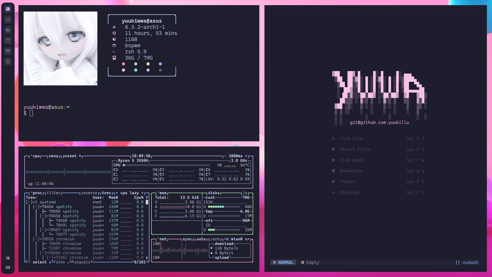
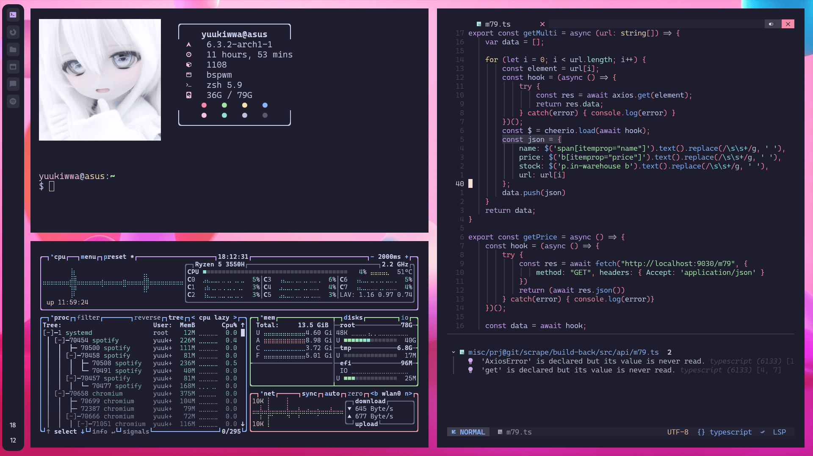

<h1 align="center">git@github.com:yuukiwwa/.files</h1>
<p align="center">this repository contains my .files</p>



```vim
    Operating system      : Arch linux
    Window manager        : BSPWM
    Keyboard handler      : SXHKD
    Bar(s)                : EWW / Polybar
    Terminal(s)           : Kitty / Alacritty
    Shell                 : ZSH
    Text/Code Editor      : NVIM ( + NvChad )
    Theming               : Catppucin Mocha
```

### Neovim

my neovim configuration can be found in (git@github.com:yuukiwwa/nvchad-config)[https://github.com/yuukilla/nvchad-config/] repository


### Screenshots



